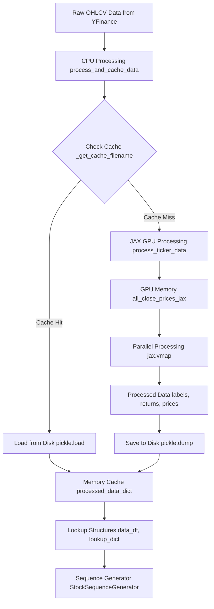
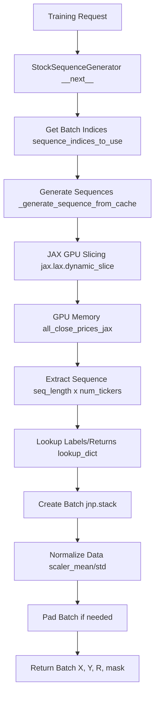
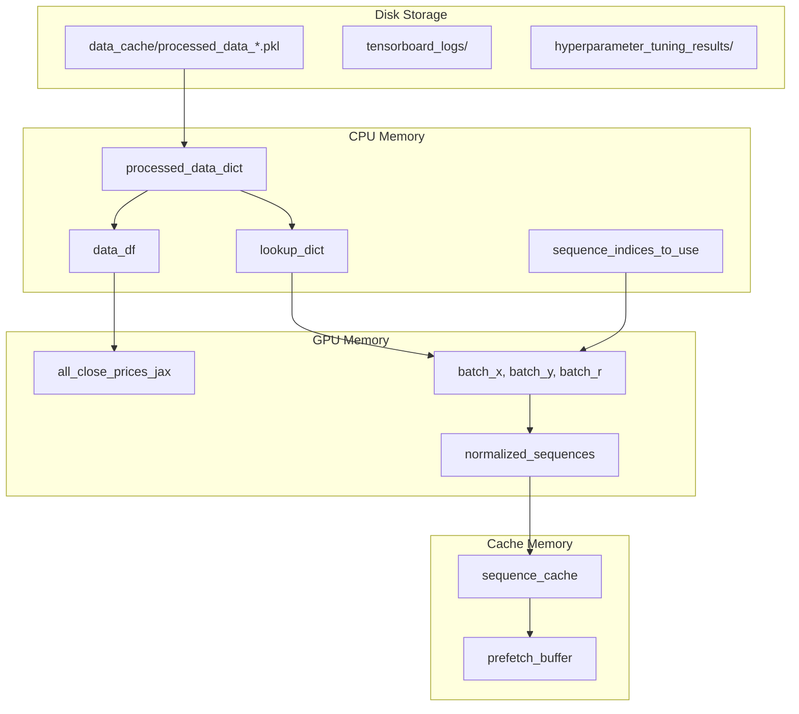
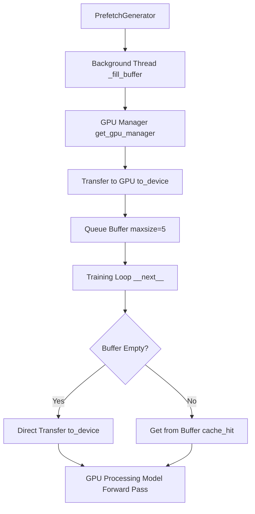
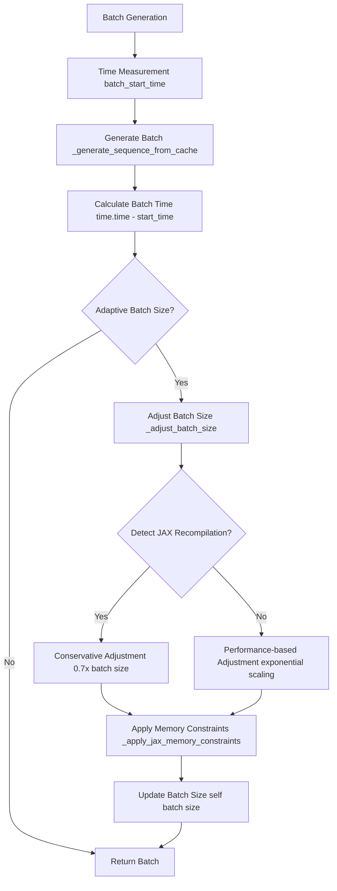
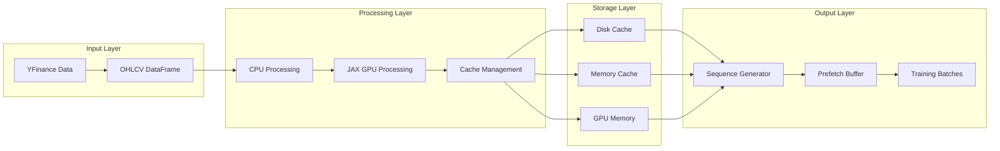
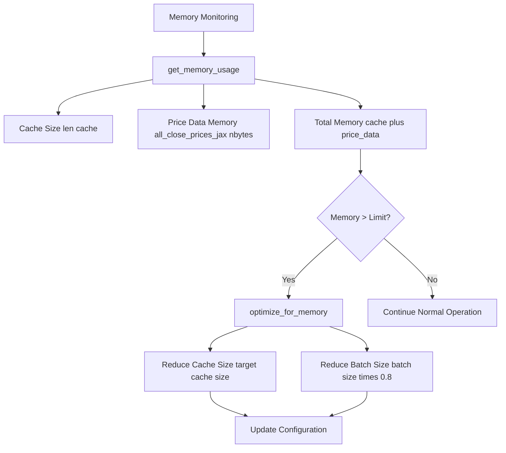
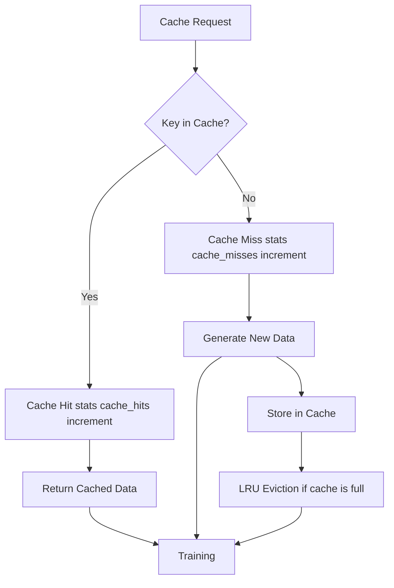

# Preprocessing, Caching & Restore System - Visual Flow

## Overview
The JAX GPT Stock Predictor uses a sophisticated multi-level caching system to optimize data processing and GPU utilization. Here's how the data flows through the system:

## 1. Initial Data Processing & Caching Flow

## 2. Runtime Sequence Generation Flow

## 3. Memory Hierarchy & Data Storage

## 4. Prefetching & GPU Optimization Flow

## 5. Adaptive Batch Size & Memory Management

## 6. Data Flow Architecture

## 7. Memory Usage Patterns

## 8. Cache Hit/Miss Statistics

## Key Performance Optimizations

### 1. **Multi-Level Caching**
- **Disk Cache**: Persistent storage of processed data
- **Memory Cache**: Fast access to frequently used sequences
- **GPU Memory**: Pre-allocated arrays for batch processing

### 2. **JAX GPU Acceleration**
- **JIT Compilation**: `@partial(jax.jit, static_argnums=(1, 2, 3))`
- **Vectorized Operations**: `jax.vmap(process_time_point)`
- **Memory-Efficient Slicing**: `jax.lax.dynamic_slice`

### 3. **Adaptive Batch Sizing**
- **Performance Monitoring**: Track batch generation times
- **JAX Recompilation Detection**: Sudden 2x time increase
- **Memory Pressure Response**: Reduce batch size under memory constraints

### 4. **Prefetching System**
- **Background Threading**: Load data while GPU processes current batch
- **Queue Management**: Buffer multiple batches ahead
- **GPU Transfer Optimization**: Minimize data transfer overhead

## Memory Usage Breakdown

| Component | Memory Type | Size | Purpose |
|-----------|-------------|------|---------|
| `all_close_prices_jax` | GPU Memory | ~100MB | All ticker price data |
| `data_df` | CPU Memory | ~50MB | Processed data lookup |
| `lookup_dict` | CPU Memory | ~10MB | Fast label/return access |
| `sequence_cache` | CPU Memory | Variable | Frequently used sequences |
| `prefetch_buffer` | GPU Memory | ~50MB | Pre-loaded batches |

## Performance Metrics

- **Cache Hit Rate**: Typically 80-95% after warmup
- **Batch Generation Time**: 0.01-0.05 seconds per batch
- **GPU Memory Utilization**: 60-80% during training
- **Disk I/O**: Minimal after initial cache creation

This system ensures optimal GPU utilization while maintaining fast data access and minimal memory overhead. 