# GPT Classifier Model Architecture - Input Shape Projections

```mermaid
graph TD
    %% Input Layer
    A[Input: batch_size × seq_length × num_features] --> B[Input Projection]
    B --> C[Linear: num_features → d_model]
    C --> D[Shape: batch_size × seq_length × d_model]
    
    %% Positional Encoding
    D --> E[Positional Encoding]
    E --> F[Add sinusoidal encodings]
    F --> G[Shape: batch_size × seq_length × d_model]
    
    %% Input Dropout
    G --> H[Input Dropout]
    H --> I[Shape: batch_size × seq_length × d_model]
    
    %% Transformer Blocks
    I --> J[Transformer Block 1]
    J --> K[Multi-Head Attention]
    K --> L[Layer Norm 1]
    L --> M[Shape: batch_size × seq_length × d_model]
    
    M --> N[Feed-Forward Layer 1]
    N --> O[Linear: d_model → d_ff]
    O --> P[Shape: batch_size × seq_length × d_ff]
    
    P --> Q[GELU Activation]
    Q --> R[Shape: batch_size × seq_length × d_ff]
    
    R --> S[LIF Layer Processing]
    S --> T[Spike Generation]
    T --> U[Shape: batch_size × seq_length × d_ff]
    
    U --> V[Combine GELU + LIF]
    V --> W[Shape: batch_size × seq_length × d_ff]
    
    W --> X[Feed-Forward Layer 2]
    X --> Y[Linear: d_ff → d_model]
    Y --> Z[Shape: batch_size × seq_length × d_model]
    
    Z --> AA[Dropout]
    AA --> BB[Layer Norm 2]
    BB --> CC[Shape: batch_size × seq_length × d_model]
    
    %% Additional Transformer Blocks
    CC --> DD[Transformer Block 2]
    DD --> EE[Transformer Block N]
    EE --> FF[Shape: batch_size × seq_length × d_model]
    
    %% Output Processing
    FF --> GG[Take Last Token]
    GG --> HH[Shape: batch_size × d_model]
    
    HH --> II[Apply Padding Mask]
    II --> JJ[Shape: batch_size × d_model]
    
    JJ --> KK[Output Projection]
    KK --> LL[Linear: d_model → num_tickers × num_classes]
    LL --> MM[Shape: batch_size × num_tickers × num_classes]
    
    %% Final Output
    MM --> NN[Logits Output]
    NN --> OO[Shape: batch_size × num_tickers × num_classes]
    
    %% Style Definitions
    classDef inputLayer fill:#e1f5fe
    classDef projectionLayer fill:#f3e5f5
    classDef attentionLayer fill:#fff3e0
    classDef feedforwardLayer fill:#e8f5e8
    classDef lifLayer fill:#ffebee
    classDef outputLayer fill:#fce4ec
    
    class A,B,C inputLayer
    class D,E,F,G,H,I projectionLayer
    class J,K,L,M attentionLayer
    class N,O,P,Q,R feedforwardLayer
    class S,T,U,V,W lifLayer
    class X,Y,Z,AA,BB,CC feedforwardLayer
    class DD,EE,FF attentionLayer
    class GG,HH,II,JJ,KK,LL,MM,NN,OO outputLayer
```

## Key Shape Transformations

### Input Processing
- **Initial Input**: `(batch_size, seq_length, num_features)`
- **After Input Projection**: `(batch_size, seq_length, d_model)`
- **After Positional Encoding**: `(batch_size, seq_length, d_model)`

### Transformer Block Processing
- **Multi-Head Attention**: Maintains shape `(batch_size, seq_length, d_model)`
- **Feed-Forward Expansion**: `(batch_size, seq_length, d_model)` → `(batch_size, seq_length, d_ff)`
- **LIF Processing**: Processes `(batch_size, seq_length, d_ff)` with spike generation
- **Feed-Forward Contraction**: `(batch_size, seq_length, d_ff)` → `(batch_size, seq_length, d_model)`

### Output Processing
- **Last Token Selection**: `(batch_size, seq_length, d_model)` → `(batch_size, d_model)`
- **Final Projection**: `(batch_size, d_model)` → `(batch_size, num_tickers × num_classes)`
- **Reshape**: `(batch_size, num_tickers × num_classes)` → `(batch_size, num_tickers, num_classes)`

## Neuron Connectivity

### Attention Mechanism
- Each position attends to all other positions
- `num_heads` parallel attention mechanisms
- Each head processes `d_model / num_heads` dimensions

### LIF Layer Processing
- Processes temporal dynamics in the feed-forward path
- Generates spikes based on membrane potential
- Combines with GELU activation for enhanced feature representation

### Output Neurons
- `num_tickers` separate output neurons per class
- Each ticker gets `num_classes` output neurons
- Total output neurons: `num_tickers × num_classes` 